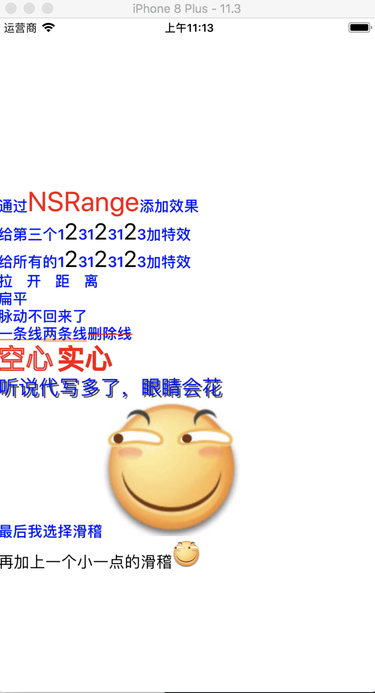

# YHAttributeString
链式设置NSAttributeString



```
  NSString *str = @"通过NSRange添加效果\n给第三个123123123加特效\n给所有的123123123加特效\n拉开距离\n扁平\n脉动不回来了\n一条线两条线删除线\n空心 实心\n听说代写多了，眼睛会花\n最后我选择滑稽";


  NSMutableAttributedString *attS = str.attributedString;
  attS.whole.color([UIColor blueColor]).font([UIFont boldSystemFontOfSize:16]);
  attS.range(2, 7).color([UIColor redColor]).font([UIFont systemFontOfSize:30]);
  attS.matches(@"2").color([UIColor blackColor]).font([UIFont systemFontOfSize:25]);
  attS.matches(@"拉开距离").textSpace(15);
  attS.matches(@"一条线").underLine(NSUnderlineStyleSingle, [UIColor orangeColor]);
  attS.matches(@"两条线").underLine(NSUnderlineStyleDouble, [UIColor orangeColor]);
  attS.matches(@"删除线").Strikethrough(NSUnderlineStyleSingle, [UIColor redColor]);
  attS.matches(@"空心").stroke(5).color([UIColor redColor]).font([UIFont systemFontOfSize:30]);
  attS.matches(@"实心").stroke(-5).color([UIColor redColor]).font([UIFont systemFontOfSize:30]);

  NSShadow *shadow = [[NSShadow alloc] init];
  shadow.shadowColor = [UIColor darkGrayColor];
  shadow.shadowOffset = CGSizeMake(2, 2);
  attS.matches(@"听说代写多了，眼睛会花").shadow(shadow).font([UIFont systemFontOfSize:22]);
  attS.join([UIImage imageNamed:@"huaji.jpg"], 0);
  attS.append(@"\n再加上一个小一点的滑稽".attributedString).joinWithSize([UIImage imageNamed:@"huaji.jpg"], 0, CGSizeMake(30, 30));

  self.label.attributedText = attS;

```
